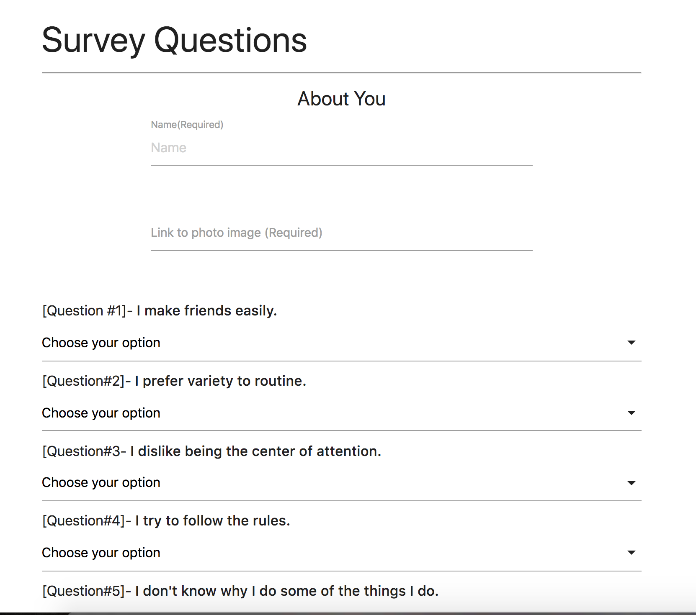

# friendFinder

### How It Works

The main functionality of this app is to allow the user to match themselves to a new friend. The results are based on the answers of 10 questions and will be comparing to the users already on the database.

### How To Use

To begin your seach click on the following link [here!](https://infinite-meadow-39120.herokuapp.com/)

### Technologies Used

* node.js
* express.js
* mySQL

### Screenshots

Home Page

Survey Page
